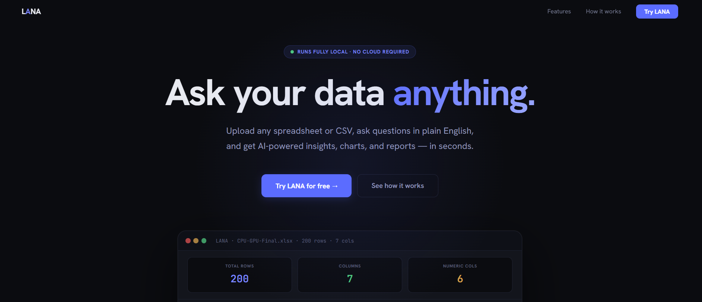
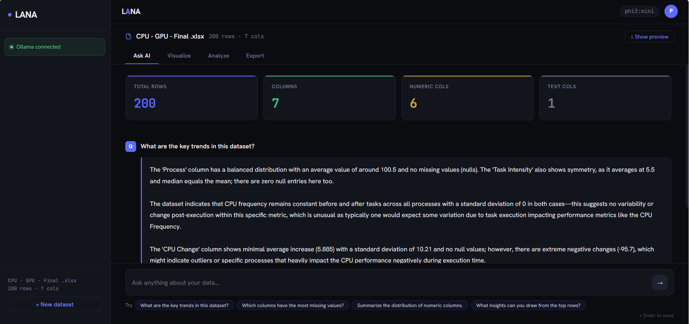
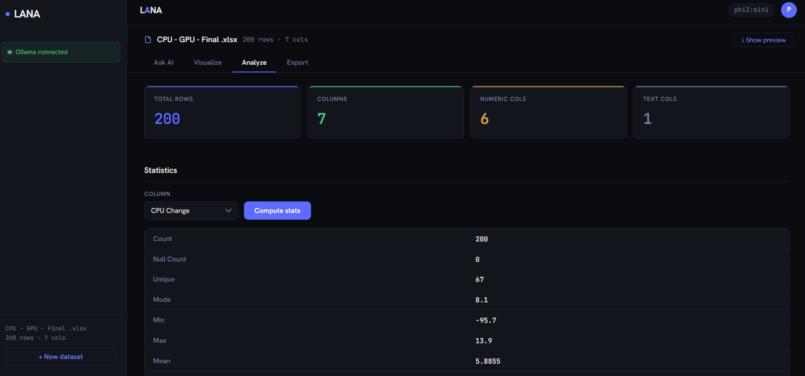
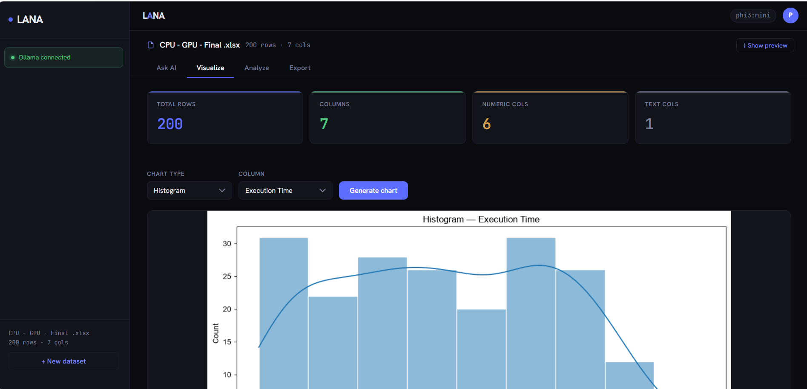
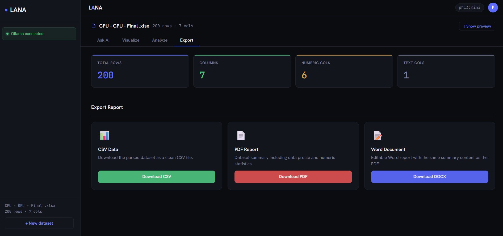

<div align="center">

# LANA — Load · Analyze · Advance

### Ask your data anything. Fully local. Zero cloud dependency.

LANA is a **local-first AI data analysis platform** — upload any dataset, clean it, ask questions in plain English, and get AI-powered insights, interactive visualizations, and polished reports. Everything runs on your machine.

<br/>

[](https://python.org)
[](https://fastapi.tiangolo.com)
[](https://react.dev)
[](https://vitejs.dev)
[](https://ollama.com)
[](https://scikit-learn.org)
[](LICENSE)

[**Quick Start**](#️-installation--setup) · [**Architecture**](#️-architecture--system-design) · [**Engineering Log**](docs/engineering-changelog.md) · [**Report a Bug**](https://github.com/PreethamNoelP/LANA-load_analyze_advance/issues)

</div>

---

## 📷 Demo

> **Upload → Clean → Ask → Visualize → Export** — all in under 60 seconds.

<div align="center">

| Landing Page | Ask AI | Analyze |
|:---:|:---:|:---:|
|  |  |  |

| Visualize | Export |
|:---:|:---:|
|  |  |

</div>

> Clone the repo and run it yourself in under 2 minutes — see [Quick Start](#️-installation--setup).

---

## 🧠 Problem Statement

Data analysis today forces a painful trade-off:

- **Cloud tools** (Tableau, Power BI, DataRobot) cost hundreds per month and send your data to third-party servers.
- **Code-based analysis** (pandas, matplotlib) requires Python expertise most teams don't have.
- **AI-powered tools** (ChatGPT plugins, Claude) require an internet connection and surrender data privacy.

For individuals, researchers, and organizations handling sensitive data — **none of these work**.

---

## 💡 Solution Overview

LANA takes a different approach: **bring the AI to the data, not the data to the AI.**

- A **FastAPI backend** wraps production-grade Python analysis modules (pandas, scikit-learn, seaborn) into a clean REST API.
- A **React frontend** delivers a ChatGPT-style interface — upload, clean, ask, visualize, export — with zero configuration.
- An **Ollama integration** runs open-source LLMs (Llama 3, Phi-3, Mistral, Gemma) fully locally — **zero data leaves your machine**.

The result: enterprise-quality data analysis with the simplicity of a chat interface, running entirely offline.

---

## ✨ Key Features

| Feature | Description |
|---|---|
| 🗂️ **Multi-format Upload** | Streamed, memory-bounded upload of CSV, Excel (`.xlsx`/`.xls`), and JSON. Instant schema detection, plus a bundled sample dataset if you don't have a file handy. |
| 🧹 **Explainable Data Cleaning** | Auto-detect duplicates, missing values (two independent outlier rules — IQR and MAD), and text inconsistencies. Every suggested fix carries its statistical reasoning, nothing destructive runs by default, and every change is recorded in a step-by-step transformation log noting exactly which steps were destructive. |
| 🤖 **Grounded, Validated Answers** | Every question is answered from a structured fact ledger LANA computes from your data, never from raw rows or the model's own recall. Every numeric claim in the answer is then checked against that ledger and flagged as verified, derived, or unsupported — with an in-app panel stating exactly what that check does and doesn't catch. |
| 📊 **9 Chart Types** | Histogram, Line, Bar, Scatter, Box, Heatmap, Violin, Pie, Area — rendered server-side as crisp PNGs. Large datasets are drawn from a fixed, disclosed sample rather than silently getting slower. |
| 📐 **Rigorous Statistics** | 15+ metrics per column (mean, median, std, IQR, skew, kurtosis…) with 95% confidence intervals; correlation scans corrected for multiple testing (Benjamini-Hochberg FDR) so "significant" isn't just a raw p-value. |
| 📉 **Linear Regression** | OLS with R², coefficient CI95, and diagnostics — heteroscedasticity, residual normality, high-leverage points — plus a plain-English interpretation. |
| 📄 **One-click Export** | Download as CSV (streamed, bounded memory even on very large exports), or generate a PDF/DOCX report that includes the cleaning provenance and quality caveats behind the numbers, not just the numbers. |
| ⚙️ **Adapts to Your Machine** | Upload and session-memory limits are derived from the host's actual RAM at startup, not a flat constant — the same build works on an 8 GB laptop and a 64 GB workstation. Check what it chose at `GET /health`. |
| 🔒 **100% Local & Private** | No cloud API. No telemetry. No data leaves your machine. |
| 🎨 **Production UI** | Dark-theme React SPA with a ChatGPT-style chat interface, sessions that survive a page refresh, and confirmation before anything destructive. |
| 🔌 **Pluggable LLM Backend** | Swap between Ollama and any OpenAI-compatible endpoint (Groq, LM Studio, Together.ai) via `.env`. |

---

## 🏗️ Architecture / System Design

```
┌──────────────────────────────────────────────────────────────────────┐
│                      Browser  (React 18 + Vite)                       │
│                                                                       │
│  Landing → Upload → [Ask AI | Clean | Visualize | Analyze | Export]  │
│    (session id persisted in sessionStorage — survives a refresh)     │
│                              ↕  fetch /api/*                          │
└───────────────────────────────┬──────────────────────────────────────┘
                                │  Vite dev proxy  :5173 → :8000
                                ↓
┌──────────────────────────────────────────────────────────────────────┐
│                     FastAPI  (Uvicorn ASGI)                            │
│                                                                       │
│  GET  /health          →  host RAM/CPU + derived limits + LLM status  │
│                                                                       │
│  POST /upload          →  ingest.spool_upload() (streamed, no 3x copy)│
│                        →  admission check against host-derived budget │
│                        →  optimize_dtypes() (lossless) → Session      │
│                                                                       │
│  GET  /profile         →  Session.profiles() (cached per version)     │
│  GET  /lineage         →  transformation log: raw → active version    │
│  GET  /recommendations →  charts/analyses this dataset's shape suits  │
│                                                                       │
│  GET  /clean/preview   →  detect_issues(df)  → JSON + reasoning       │
│  POST /clean/apply     →  apply_cleaning(df, ops) → (df, ledger)      │
│  POST /clean/version   →  switch active view (original/cleaned)       │
│  GET  /clean/status    →  which version is active, and how it got there│
│                                                                       │
│  POST /query(/stream)  →  Session.context() → build_context()         │
│                        →  facts + bounded prompt (LIMITS disclosed)   │
│                        →  LLMProvider.answer_question()               │
│                        →  validate_answer() → verified/derived/       │
│                           unsupported, per numeric claim              │
│  GET  /validator/capabilities → what that check does and doesn't catch│
│                                                                       │
│  POST /chart           →  create_chart(df, type, col) → PNG bytes     │
│                           (sampled + disclosed above the plot limit)  │
│  GET  /stats           →  compute_statistics(series)  → JSON + CI95   │
│  GET  /correlation     →  compute_correlations() + BH q-values         │
│  POST /regression      →  perform_linear_regression() → JSON + CI     │
│                           + heteroscedasticity/normality diagnostics  │
│  GET  /export/*        →  generate_pdf / generate_word / streamed csv│
└──────────┬───────────────────────────┬───────────────────────────────┘
           │                           │
           ↓                           ↓
┌─────────────────┐        ┌──────────────────────────┐
│   app/llm/      │        │  app/analysis/            │
│                 │        │  app/data/                │
│  OllamaProvider │        │  app/visualization/       │
│  OpenAICompat   │        │  app/export/               │
│  Provider       │        │  app/resources/            │
│  (ABC pattern)  │        │                           │
│                 │        │  pandas · scikit-learn    │
│                 │        │  seaborn · fpdf · docx    │
└──────┬──────────┘        └──────────────────────────┘
       │
       ↓
┌──────────────────┐
│   Ollama :11434  │
│                  │
│   phi3:mini      │
│   llama3.1:8b    │
│   mistral:7b     │
│   (any model)    │
└──────────────────┘
```

**Key design decisions:**

- **In-memory session store, one object per session** — a `Session` holds the raw DataFrame, an optional cleaned one, and a per-version cache of its column profile and grounded LLM context (both are expensive to recompute and identical for the life of that version). `.active` transparently returns whichever version is active, so downstream endpoints don't know or care whether cleaning happened.
- **Host-adaptive resource limits** — upload size and total session memory are derived from the machine's actual RAM at startup (`app/resources.py`), not a flat constant, with a live free-memory check at admission time as a second gate. An explicit `.env` value always overrides the probe.
- **Grounded, then validated** — `build_context()` computes a fact ledger (column stats, category breakdowns, group averages, FDR-corrected correlations) from the data *before* the question is even read, bounds it to the model's context window, and states what it had to omit. `validate_answer()` then checks every number the model produced against that same ledger and shows the verdict — not a black-box "trust me," a documented, code-referenced trace (see `docs/provenance.md`).
- **Server-side chart rendering** — matplotlib/seaborn runs on the backend; the frontend receives PNG bytes. No JavaScript charting library, consistent quality, and a chart drawn from a sample says so directly on the image.
- **LLMProvider ABC** — a pluggable interface makes swapping local ↔ cloud LLMs a single `.env` change.
- **Vite proxy** — `/api/*` is proxied at the dev-server level, keeping the same configuration valid behind nginx in production.

---

## ⚙️ Tech Stack

### Frontend
| | Technology | Role |
|---|---|---|
| ⚛️ | React 18 | Component-based SPA |
| ⚡ | Vite 5 | Dev server, HMR, build tool |
| 🎨 | CSS Custom Properties | Dark-theme design token system |

### Backend
| | Technology | Role |
|---|---|---|
| 🚀 | FastAPI | Async REST API framework |
| 🦄 | Uvicorn | ASGI production server |
| 🐼 | pandas | Data loading, manipulation, and cleaning |
| 🔢 | NumPy | Numeric computation |
| 🤖 | scikit-learn | Linear regression (OLS) |
| 📊 | matplotlib + seaborn | Server-side chart rendering |
| 📄 | fpdf2 + python-docx | PDF and Word report generation |
| 🧠 | Ollama SDK | Local LLM integration |
| 🔌 | OpenAI SDK | OpenAI-compatible endpoint support |
| ⚙️ | python-dotenv | Environment configuration |

### Infrastructure
| | Technology | Role |
|---|---|---|
| 🦙 | Ollama | Local LLM runtime |
| 🐍 | Python 3.11+ | Backend runtime |
| 📦 | Node.js 18+ | Frontend toolchain |

---

## 📊 How It Works

**Step 1 — Upload**
```
User drops CSV/Excel/JSON (or clicks "Try with sample data")
→ Body streams into a spooled temp file — never fully buffered in RAM
→ For CSV: cost is projected from a sample and checked against this
  machine's derived memory budget before the full parse runs
→ FastAPI parses with pandas, then losslessly shrinks the frame
  (int downcasting, low-cardinality strings → categoricals)
→ DataFrame stored in-memory under a UUID session key
→ Frontend receives: rows, columns, numeric_columns, 8-row preview, quality
```

**Step 2 — Data Cleaning (optional)**
```
LANA scans the original DataFrame and reports:
→ Duplicate rows (count + sample)
→ Missing values per column (null count, % of total, suggested fill)
→ Outliers per numeric column (IQR method: Q1−1.5×IQR, Q3+1.5×IQR)
→ Text inconsistencies (same value in different cases, e.g. "Yes"/"yes"/"YES")

User configures operations per-column:
→ Fill nulls: mean / median / mode / zero / drop rows
→ Remove outliers: toggle per column
→ Fix text: pick canonical form per variant group

Apply Cleaning stores a separate cleaned DataFrame.
All downstream tabs (Ask AI, Visualize, Analyze, Export) use whichever
version is active. The original is always preserved and switchable.
```

**Step 3 — Grounded Context, Built Before the Question Is Read**
```
Every AI query triggers build_context(df):
→ Per-column facts (type, nulls, mean/median/std, IQR, skew) — no raw rows
→ Exact category breakdowns and group-by averages
→ Correlations, corrected for multiple testing (BH FDR)
→ Cleaning lineage, if the active version was cleaned
→ Bounded to the model's context window; anything dropped is stated,
  not silently truncated
Every fact is also kept in a parallel ledger for step 5 to check against.
```

**Step 4 — LLM Query, Then Checked Against What Was Computed**
```
Question + grounded context → Ollama (local inference)
→ Model answers using only the facts it was shown
→ validate_answer() extracts every number in the answer and checks it
  against the same fact ledger, within a 2% tolerance
→ Each claim lands as verified / derived / unsupported
→ Only unsupported claims and unresolved references surface a warning —
  see docs/provenance.md for exactly what this does and doesn't catch
```

**Step 5 — Visualization**
```
User picks chart type + column
→ POST /chart → FastAPI runs matplotlib/seaborn
→ Returns raw PNG bytes
→ Frontend creates a blob URL and renders the image inline
```

**Step 6 — Statistical Analysis**
```
Statistics:  pandas Series → 15-metric profile (count, mean, median,
             std, variance, IQR, skewness, kurtosis, percentiles…)

Regression:  scikit-learn OLS → R² score, coefficient, intercept, RMSE
             + auto-generated plain-English model interpretation
```

**Step 7 — Export**
```
CSV   → df.to_csv() streamed as a file download
PDF   → fpdf2 builds a formatted report with dataset summary
DOCX  → python-docx builds an editable Word document
```

---

## 🛠️ Installation & Setup

### Prerequisites

| Requirement | Version |
|---|---|
| Python | 3.11+ |
| Node.js | 18+ |
| Ollama | Latest ([install](https://ollama.com)) |

### 1 — Clone

```bash
git clone https://github.com/PreethamNoelP/LANA-load_analyze_advance.git
cd LANA-load_analyze_advance
```

### 2 — Backend

```bash
python -m venv .venv

# Windows
.venv\Scripts\activate
# macOS / Linux
source .venv/bin/activate

pip install -r requirements.txt
```

### 3 — Environment

```bash
cp .env.example .env
```

```env
# .env
LLM_PROVIDER=ollama
LLM_MODEL=phi3:mini          # or llama3.1:8b, mistral:7b, gemma2:2b
OLLAMA_HOST=http://localhost:11434
LLM_TEMPERATURE=0.3
LLM_MAX_TOKENS=2048
```

### 4 — Frontend

```bash
cd frontend
npm install
```

### 5 — Pull a model

```bash
ollama pull phi3:mini         # ~2 GB — fast and capable
# or
ollama pull llama3.1:8b       # ~5 GB — higher quality
```

---

## ▶️ Usage

Open three terminals:

```bash
# Terminal 1 — Ollama (skip if already running as a service)
ollama serve

# Terminal 2 — Backend API
.venv\Scripts\activate   # or source .venv/bin/activate
uvicorn backend.main:app --reload

# Terminal 3 — Frontend
cd frontend && npm run dev
```

Open **[http://localhost:5173](http://localhost:5173)** in your browser.

> [!IMPORTANT]
> **LANA has no authentication, and is built to run on your own machine.**
> Every endpoint is open to anyone who can reach the port: uploading files,
> running analysis, generating reports and spending time on your local model.
> That is the right trade for a single-user local tool, and it is the reason
> the defaults bind to localhost and the CORS allowlist rejects `*`.
>
> Do not run it with `--host 0.0.0.0`, behind a public reverse proxy, or on a
> shared network without putting authentication in front of it yourself. The
> upload and request-size limits are there to keep a mistake from taking the
> machine down — they are not a substitute for access control.

### User flow

```
1. Drop a CSV, Excel, or JSON file on the upload screen
   → No file handy? Click "Try with sample data" for an instant demo
   → KPI tiles: row count, column count, numeric/text split, data quality
   → Toggle "Show preview" to inspect raw data
   → Your session id is remembered — refreshing the page restores it

2. Ask AI — ChatGPT-style interface
   → "What are the outliers in this column?"
   → "Which feature correlates most with execution time?"
   → Click suggestion chips, or a dataset-specific "suggested next step"
   → Messages survive tab switches — context is never lost
   → Every answer states which figures it verified against the data

3. Clean (optional, recommended before analysis)
   → Auto-scan detects duplicates, nulls, outliers, text inconsistencies
   → Configure what to fix per column
   → Apply Cleaning — original is preserved, toggle between views
   → All tabs automatically use the active version

4. Visualize
   → Select chart type and column → Generate chart
   → Scatter Plot: pick X and Y columns independently

5. Analyze
   → Statistics: pick any numeric column → 15-metric profile
   → Regression: pick X and Y columns → R², coefficient, RMSE + interpretation

6. Export
   → CSV: raw data download
   → PDF: formatted analysis report
   → DOCX: editable Word document
```

### Using an OpenAI-compatible endpoint

```env
LLM_PROVIDER=openai_compat
OPENAI_COMPAT_BASE_URL=https://api.groq.com/openai/v1
OPENAI_COMPAT_API_KEY=gsk_your_key_here
LLM_MODEL=llama-3.1-8b-instant
```

Restart the backend — no other changes required.

---

## 📈 Results / Impact

| Metric | Value |
|---|---|
| Time to first AI insight | < 30s from upload (or instant, via the bundled sample dataset) |
| Chart generation latency | ~1–2s (server-side render, sampled above 50k points) |
| LLM response (phi3:mini, CPU) | ~3–8s |
| Grounded answer accuracy, measured | 82.5% correct on a 40-question benchmark vs. 52.5% for an ungrounded baseline — same model, same questions (`eval/`, see `docs/engineering-changelog.md`) |
| Supported input formats | CSV, Excel `.xlsx`/`.xls`, JSON |
| Export formats | CSV (streamed), PDF, DOCX — each carrying the cleaning provenance behind the numbers |
| Chart types | 9 |
| Statistical metrics per column | 15+, with 95% confidence intervals |
| Cleaning operations | Dedup, null fill, dual-rule outlier detection (IQR + MAD), winsorize, text normalization — every step logged, most non-destructive by default. Undo is switching the whole session back to the original version; there is no per-step undo. |
| Backend test suite | 117 tests, run on every push (`pytest tests/ -q`) |
| Data privacy | 100% — zero external network calls |

---

## 🔍 Challenges & Learnings

**Ollama SDK breaking change (v0.3.0+)**
Response objects changed from dicts to typed objects. Fix: wrote a thin provider adapter with a clear `generate()` interface contract. Lesson: isolate third-party SDK calls behind an ABC.

**Server-side vs. client-side charting**
Started with D3.js. Switched to backend matplotlib/seaborn — eliminated a large JS dependency, ensured consistent render quality, and kept all chart logic co-located with the data layer.

**Flex layout + scroll in nested SPAs**
A ChatGPT-style fixed-input / scrollable-thread layout inside nested flex containers silently breaks scroll without `minHeight: 0` on intermediate containers — a non-obvious CSS rule that's easy to miss.

**LLM context quality**
Feeding raw DataFrame strings to the LLM produced unreliable answers. Structured context generation — column types, null rates, category breakdowns, stat ranges — dramatically improved grounding and reduced hallucination. This first pass (`generate_context()`, still used for export reports) has since been complemented by `build_context()` plus `validate_answer()` for the Q&A path specifically, which checks the model's own numbers against what was actually computed rather than trusting that better context alone is enough — see the entry below.

**Non-destructive data cleaning**
Storing a separate cleaned DataFrame alongside the original (rather than mutating in place) lets users toggle between versions at any point. The key insight: `Session.active` acts as a transparent router — all existing endpoints get the right version without knowing about cleaning at all.

**"Grounded" isn't the same as "verified" — measure the gap, don't assume it**
A structured fact ledger prepended to every prompt reduces hallucination, but it doesn't prove an answer is correct on its own. Built a small offline eval harness (`eval/`) that generates seeded synthetic datasets, resolves ground truth from LANA's own statistics functions, and runs 40 labeled questions against a real local model under two conditions (grounded vs. a naive baseline). First run: grounded answers scored *worse* than the baseline on trivial questions — the model was pattern-matching a single refusal example in the system prompt almost verbatim, regardless of whether the fact was actually present. Fixed by rewording the prompt's final instruction to model search-then-answer instead of licensing refusal as the default (full account in `docs/engineering-changelog.md`). Full-suite result after the fix: 82.5% correct vs. 52.5% for the baseline — and the eval run itself surfaced a genuine remaining blind spot (a number correctly matched to the wrong column/label), which is now documented rather than hidden, both in `docs/provenance.md` and in a collapsible panel in the Ask AI UI.

**A memory budget has to be a policy, not a live reading**
Sizing the upload/session limits from *available* RAM at request time made the same file's admission decision swing by several times depending on how many browser tabs happened to be open when the process started — non-deterministic in a way a user could neither see nor predict. Fixed by deriving the budget from *total* RAM once at startup (a stable policy) and using a separate, live free-memory check only as a second gate against a genuinely busy machine at admission time — not as the basis for the budget itself.

---

## 🤝 Contributing

Contributions are welcome.

```bash
# Fork, then clone your fork
git checkout -b feature/your-feature-name

# Make changes, then open a Pull Request
```

**High-impact areas:**
- New chart types → `app/visualization/charts.py`
- New export formats → `app/export/exporters.py`
- New LLM providers → `app/llm/`
- Additional cleaning operations → `app/data/cleaner.py`
- Frontend UX improvements → `frontend/src/components/`

Please open an issue before large changes.

---

## 📄 License

MIT — see [LICENSE](LICENSE) for details.

---

## 👤 Author

<div align="center">

**Preetham Noel P**

*Building tools that make data accessible to everyone.*

[](https://github.com/PreethamNoelP)
[](https://www.linkedin.com/in/preethamnoelp/)

</div>

---

<div align="center">

**If LANA saved you time, a ⭐ helps others find it.**

*Built with Python, React, and a conviction that data tools should be private, fast, and free.*

</div>